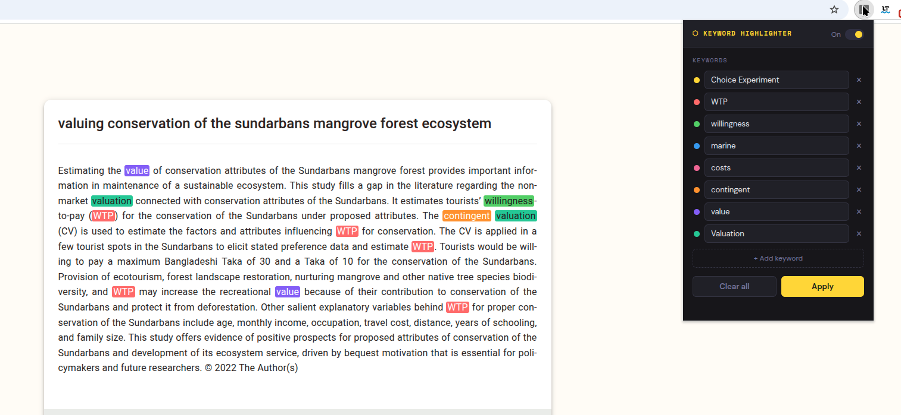

# ASReview Keyword Highlighter

A Chrome extension that automatically highlights multiple keywords in different colors while screening studies in [ASReview](https://asreview.nl/). Speeds up title/abstract screening by making your inclusion and exclusion criteria immediately visible.

---

## The problem

ASReview's review interface shows you one abstract at a time. To quickly judge relevance, you want to spot your key terms at a glance — but the interface has no built-in keyword highlighting, and browser search (Ctrl+F) only handles one term at a time.

## The solution

This extension lets you define up to 10 keywords. Each gets a distinct highlight color and is marked automatically as ASReview loads each new abstract — no need to search manually.

---

## Features

- Up to **10 keywords**, each highlighted in a different color
- Works automatically as ASReview loads new records (no need to re-apply)
- Keywords are **saved between sessions** — set them once per review project
- Toggle highlights on/off without losing your keyword list
- Works on any website, not just ASReview

---

## Installation

Chrome extensions built outside the Web Store require a one-time manual install. It takes about 30 seconds.

**1. Download the extension**

Go to the [Releases](../../releases) page and download the latest `asreview-keyword-highlighter.zip`. Unzip it anywhere on your computer.

**2. Open Chrome Extensions**

Go to `chrome://extensions` in your browser.

**3. Enable Developer Mode**

Toggle **Developer mode** on in the top-right corner.

**4. Load the extension**

Click **Load unpacked** and select the unzipped folder.

The extension icon will appear in your Chrome toolbar. Pin it for easy access.

---

## Usage

1. Open ASReview and start a review session
2. Click the extension icon in the toolbar
3. Enter your keywords (one per row)
4. Click **Apply** or press Enter
5. Keywords are highlighted immediately and stay highlighted as you move through records

To update your keywords, open the popup, edit the list, and click Apply again.

---

## Updating the extension

When a new version is released:

1. Download the new zip from the [Releases](../../releases) page and unzip it
2. Go to `chrome://extensions`
3. Click the reload ↻ button on the extension card
4. Refresh your ASReview tab

---

## Contributing

Bug reports and suggestions are welcome — open an [issue](../../issues). Pull requests are also welcome if you want to add features.

Some ideas for future improvements:

- Case-sensitive matching option
- Export/import keyword sets for different review projects
- Match whole words only option

---

## License

MIT — free to use, modify, and share.
